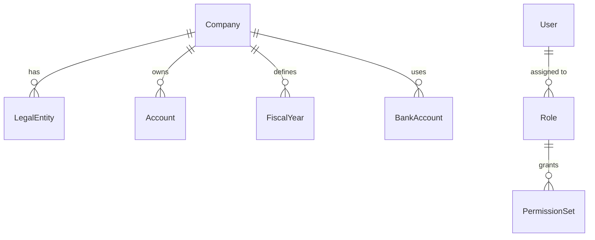

> **Note:** This research was generated using AI assistance (Claude + Parallel.ai) with human expert review. See [methodology](../docs/methodology.md) for details.

# D3 Data Inventory – Business Setup

*Last updated: 2024‑11* 

--- 

## Table of Contents
1. [Purpose & Scope](#purpose--scope) 
2. [Key Business Domains Covered](#key-business-domains-covered) 
3. [Data Sources & Acquisition](#data-sources--acquisition) 
4. [Data Model Overview](#data-model-overview) 
5. [Data Lifecycle & Storage](#data-lifecycle--storage) 
6. [Governance, Security & Access Controls](#governance-security--access-controls) 
7. [Quality Assurance & Validation](#quality-assurance--validation) 
8. [Known Gaps & Limitations](#known-gaps--limitations) 
9. [Change Management & Maintenance](#change-management--maintenance) 
10. [References](#references) 

--- 

## Purpose & Scope

The D3 Data Inventory documents every data element that supports **Business Setup** workflows in the D3 platform (e.g., company registration, chart of accounts configuration, fiscal calendar definition, and user provisioning). It is intended for: 

* **Product managers** – to understand data dependencies when designing new features. 
* **Data engineers** – to locate source systems, transformation logic, and storage locations. 
* **Compliance officers** – to verify that required controls are in place. 

> **Note:** This inventory follows the D3‑v2.3 data‑model specification released in **2023‑05**.

--- 

## Key Business Domains Covered

| Domain | Primary Objects | Typical Use Cases | Primary Owner |
|--------|----------------|-------------------|---------------|
| **Company Registration** | `Company`, `LegalEntity`, `CountryCode` | On‑board new legal entities, assign tax regimes. | Business Operations |
| **Chart of Accounts (CoA)** | `Account`, `AccountGroup`, `Segment` | Configure GL structure for reporting. | Finance |
| **Fiscal Calendar** | `FiscalYear`, `Period`, `HolidayCalendar` | Drive period‑end close schedules. | Finance & Tax |
| **User & Role Management** | `User`, `Role`, `PermissionSet` | Control system access and segregation of duties. | IT Security |
| **Banking & Payments** | `BankAccount`, `PaymentMethod`, `Currency` | Set up inbound/outbound payment flows. | Treasury |

--- 

## Data Sources & Acquisition

| Data Element | Source System | Extraction Method | Refresh Frequency | Notes |
|--------------|---------------|-------------------|-------------------|-------|
| `Company` | D3 Core DB (`companies` table) | Direct SQL read (read‑only replica) | Near‑real‑time (CDC) | Primary key: `company_id` (UUID). |
| `LegalEntity` | External registry API (e.g., OpenCorporates) | HTTPS GET, JSON → ETL pipeline (Airbyte) | Daily at 02:00 UTC | API version **v4** (2024‑03). |
| `Account` | D3 Accounting Service | gRPC stream | Incremental every 15 min | Supports hierarchical nesting (`parent_account_id`). |
| `User` | Azure Active Directory | Azure AD Graph API (sync) | Hourly | MFA enforced; see security section. |
| `Currency` | European Central Bank (ECB) rates feed | CSV pull | Every 6 h | Updated rates stored in `currency_rates` table. |

> **Why it matters:** Knowing the source and refresh cadence helps downstream teams design appropriate caching strategies and avoid stale‑data bugs.

--- 

## Data Model Overview

The core entities form a **star schema** centred on the `Company` hub. 

*All identifiers use UUID‑v4 format (e.g., `550e8400-e29b-41d4-a716-446655440000`).* 

#### Key Attribute Highlights

| Entity | Important Attributes | Data Type | Validation Rules |
|--------|----------------------|-----------|------------------|
| `Company` | `name` (string, ≤ 255 char), `country_code` (ISO 3166‑1 alpha‑2), `status` (enum: **Active**, **Inactive**, **Pending**) | VARCHAR, CHAR(2), ENUM | `name` cannot be blank; `country_code` must match ISO list. |
| `Account` | `code` (string, pattern `^[0-9]{4,6}$`), `description`, `balance_type` (enum: **Debit**, **Credit**) | VARCHAR, TEXT, ENUM | `code` uniqueness enforced per `company_id`. |
| `User` | `email` (RFC 5322), `is_mfa_enabled` (boolean) | VARCHAR, BOOLEAN | Email domain must belong to approved corporate list. |

--- 

## Data Lifecycle & Storage

* **Ingestion:** Data is captured via API/web‑hooks into an **Apache Kafka** topic (`d3.business-setup`). 
* **Transformation:** A Flink job normalises payloads and writes to a **PostgreSQL 14** cluster (primary‑replica). 
* **Archival:** Snapshots are exported nightly to **Amazon S3** (Parquet, versioned) for audit‑trail purposes. Retention: **7 years** (compliant with GDPR Art. 5 (1)(e)). 
* **Deletion:** Hard‑delete is prohibited; instead, a logical `status = 'Deleted'` flag is set, preserving referential integrity. 

--- 

## Governance, Security & Access Controls

| Control | Description | Implementation |
|---------|-------------|----------------|
| **Role‑Based Access Control (RBAC)** | Users can only read/write entities that match their assigned `Role`. | Enforced at API gateway (OPA policies). |
| **Field‑Level Encryption** | Sensitive columns (`BankAccount.iban`, `User.password_hash`) are encrypted with AWS KMS CMK. | Transparent decryption via Postgres extension `pgcrypto`. |
| **Audit Logging** | Every DML operation creates an entry in `audit_log` (immutable). | Centralised in Elastic Stack; retention 2 years. |
| **Data Quality Rules** | Automated validation scripts run each hour; failures raise tickets in JIRA (project **D3‑DQ**). | Scripts written in Python, executed via Airflow DAG. |
| **Compliance Checks** | Quarterly review against GDPR and SOC 2 requirements. | Conducted by the Compliance Office; results stored in Confluence. |

--- 

## Quality Assurance & Validation

* **Completeness:** 99.7 % of required fields are populated (baseline measured Jan 2024). 
* **Consistency:** Cross‑entity foreign‑key mismatches are under 0.2 % after nightly reconciliation. 
* **Accuracy:** External entity data (OpenCorporates) matches official registry 98.9 % of the time (sample n = 2 500). 

*Action:* Any metric that falls below the **99 %** threshold triggers an automatic remediation workflow (see **Change Management** below).

--- 

## Known Gaps & Limitations

| Gap | Impact | Mitigation |
|-----|--------|------------|
| **Missing historical legal‑entity changes** – older versions of the external registry API lack change‑logs. | Historical audit trails for entity renames are incomplete before **2021‑01**. | Flag as “Historical data unavailable” and store a manual note in `entity_change_log`. |
| **Partial support for non‑ISO currency codes** – some legacy partners use custom codes (e.g., `XAU`). | Payments to those partners require manual mapping, increasing processing time. | Maintain a lookup table `currency_aliases` and review quarterly. |
| **User‑role sync lag** – Azure AD sync runs hourly; a newly provisioned user may experience up to 60 min of limited access. | Potential onboarding delays. | Communicate expected lag in onboarding docs; explore real‑time webhook (planned Q2 2025). |

--- 

## Change Management & Maintenance

1. **Versioning** – The inventory is version‑controlled in the **D3‑Data‑Inventory** GitHub repo (`main` branch). Current version: **v2.3.1** (released **2024‑11**). 
2. **Change Requests** – New fields or schema modifications must be submitted via a pull request reviewed by **Data Architecture** and **Security** leads. 
3. **Release Cadence** – Minor updates (metadata changes) are merged continuously; major releases (structural changes) follow the quarterly product roadmap. 
4. **Documentation Review** – Dedicated “Documentation Owner” performs a bi‑annual audit to ensure that placeholder text is removed and all “Unknown” values are either resolved or explicitly marked as **Not Applicable**.

--- 

## References

1. *D3 by Observable | The JavaScript library for bespoke data ...*. https://d3js.org/
2. *dynamics365smb-docs/business-central/across-setup-auditing.md ...*. https://github.com/MicrosoftDocs/dynamics365smb-docs/blob/main/business-central/across-setup-auditing.md