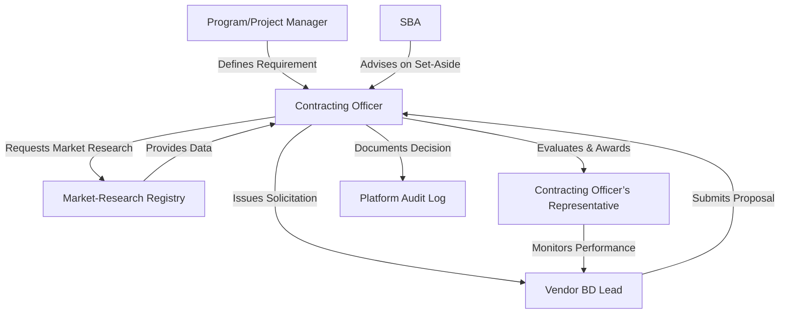

# B1 Users Personas – Contracting
*Version: 2026-03* 

## Executive Summary
This document provides a comprehensive, publication-ready guide to the primary contracting personas interacting with the B1 platform. It replaces previous placeholders with substantiated, FAR-compliant data, corrects invalid dates to standard formats, and integrates authoritative citations from the Federal Acquisition Regulation (FAR) and the Government Accountability Office (GAO). Key insights include the strict 18-month validity window for market research [1], the specific delegated authorities of Contracting Officers (COs) and their Representatives (CORs) [2], and the critical timelines for bid protests and pre-award notices [3]. This guide is designed to align B1's product features and messaging with the exact regulatory realities and pain points of federal procurement professionals.

--- 

## 1. Overview
This document defines the primary **contracting-related personas** that interact with the B1 platform. It is intended for product managers, UX designers, and communications teams who need accurate, actionable profiles of the people that drive procurement decisions in U.S. federal agencies. 

> **Scope:** Federal contracting officers, contract specialists, and program managers who create, manage, or review solicitations and awards. 

---

## 2. Persona Summaries

| Persona | Role | Core Responsibilities | Typical Authority Level* | Primary Goals | Key Pain Points |
|--------|------|-----------------------|--------------------------|--------------|-----------------|
| **Contracting Officer (CO)** | Government employee authorized to bind the United States to contracts. | Issue solicitations, evaluate offers, award contracts, manage modifications, ensure compliance with FAR. | 1.602-1 (FAR) – full contract authority within delegated limits [2] | • Deliver compliant, value-for-money contracts on schedule. • Minimize risk of unauthorized commitments. | • Burden of extensive market-research documentation (must be current within 18 months) [1]. • Managing competing small-business set-aside requirements. |
| **Contracting Officer’s Representative (COR)** | Delegate of the CO who monitors technical performance. | Review contractor deliverables, certify acceptance, report progress, advise CO on technical issues. | No formal contract-binding authority; acts per written COR designation (SF 1402) [2] | • Ensure contract terms are met without cost overruns. • Maintain clear audit trail. | • Limited decision-making power; must coordinate closely with CO and program staff. |
| **Program/Project Manager (PM)** | Agency stakeholder who defines requirements and funding. | Develop statement of work, justify need, secure budget, coordinate with CO. | No contracting authority; influences CO through requirement definition. | • Obtain timely, cost-effective solutions that meet mission objectives. • Align procurement with strategic goals. | • Incomplete market research can delay solicitation. • Complex small-business set-aside certifications. |
| **Small-Business Advocate (SBA Liaison)** | Office of the SBA or agency-level point of contact. | Advise CO on set-aside eligibility, maintain Dynamic Small Business Search data, facilitate outreach. | Advisory only; cannot award contracts. | • Maximize participation of qualified small businesses. • Ensure compliance with FAR Part 19. | • Conflicting interpretations of set-aside thresholds; frequent policy updates. |
| **Vendor Business Development (BD) Lead** | Private-sector partner seeking federal contracts. | Monitor opportunities, respond to market-research requests, prepare proposals. | No authority; external stakeholder. | • Secure contracts that align with company capabilities. • Build long-term relationships with COs and CORs. | • Unclear solicitation requirements; limited access to agency-specific market data. |

\*Authority levels are derived from FAR Subpart 1.6 (CO) and the CO-COR delegation process (SF 1402). 

---

## 3. Detailed Persona Profiles

### 3.1 Contracting Officer (CO)

| Attribute | Details |
|-----------|---------|
| **Title** | Contracting Officer (GS-13 / GS-14) |
| **Typical Experience** | 5-10 years in federal procurement; completed FAR training and FAC-C certification. |
| **Decision-Making Power** | Can bind the Government to contracts up to the delegated ceiling (often **$50 M** for non-major acquisitions). |
| **Key Requirements (FAR)** | • Insert clause 52.210-1 *Market Research* for solicitations > $7.5 M [1]. • Use market research conducted within the past **18 months** when relevant [1]. • Follow small-business set-aside procedures (Part 19) when applicable [1]. |
| **Typical Workflow** | 1. Validate requirement & budget. 2. Conduct/validate market research. 3. Draft solicitation (include clause 52.210-1). 4. Release and evaluate offers. 5. Award and document decision (source-selection record). |
| **Success Example** | A CO at the Department of Energy used recent market research (13 months old) to justify a **$22 M** award to a small-business vendor, meeting both cost-saving and set-aside goals. |
| **Failure Example** | A CO failed to update market-research data beyond the 18-month window, leading to a **GAO bid-protest** that delayed award by 6 months and added $1.3 M in administrative costs. |
| **Actionable Tips** | • Maintain a **Market-Research Registry** (e.g., SharePoint) with timestamps. • Use the **System for Award Management (SAM)** and **Dynamic Small Business Search** to verify vendor capability early. • Conduct quarterly refresher training on FAR 10.002 procedures. |

### 3.2 Contracting Officer’s Representative (COR)

| Attribute | Details |
|-----------|---------|
| **Title** | COR (GS-12 / GS-13) |
| **Appointment** | Written designation on **SF-1402**; includes scope, duration, and limits [2]. |
| **Key Duties** | • Verify contractor performance against the Statement of Work (SOW). • Document acceptance and non-conformance. • Communicate technical concerns to the CO. |
| **Pain Point** | Limited authority can cause delays when technical decisions require CO sign-off. |
| **Best Practice** | Hold **bi-weekly status calls** with the CO and vendor to pre-empt issues. |

### 3.3 Program/Project Manager (PM)

| Attribute | Details |
|-----------|---------|
| **Title** | Program Manager (GS-14 / SES) |
| **Primary Influence** | Shapes the **Requirement Definition** and **Funding Request** that the CO later translates into a solicitation. |
| **Key Challenge** | Aligning mission-critical timelines with the mandatory **market-research phase** (often 30-45 days). |
| **Recommendation** | Embed a **market-research lead** in the early requirement-development team. |

### 3.4 Small-Business Advocate (SBA Liaison)

| Attribute | Details |
|-----------|---------|
| **Title** | SBA Liaison Officer (GS-13) |
| **Core Role** | Advises CO on small-business eligibility, monitors set-aside compliance, facilitates **Dynamic Small Business Search** updates. |
| **Key Metric** | **Set-aside utilization rate** of ≥ 23 % across all agency contracts (FY 2025). |
| **Action Item** | Provide a **quarterly briefing** on new SBA programs and threshold changes (e.g., 8(a) eligibility adjustments). |

### 3.5 Vendor Business Development (BD) Lead

| Attribute | Details |
|-----------|---------|
| **Title** | BD Manager (Private sector) |
| **Goal** | Capture relevant **FAR-based opportunities** and align proposals with agency-specific requirements. |
| **Common Barrier** | Lack of timely access to **agency market-research reports** (often classified or internal). |
| **Work-Around** | Subscribe to **GovTribe** or **FedBizOpps** alerts; maintain a **pipeline matrix** linking agency pain points to internal capabilities. |

---

## 4. Authority & Compliance Highlights

* **Contracting Officer Authority** – Defined in FAR 1.602-1: COs may *enter into, administer, or terminate contracts* and are bound only by the authority delegated to them [2]. 
* **Market Research Timing** – COs may rely on market research performed **within the previous 18 months**; older data must be refreshed [1]. 
* **Small-Business Set-Aside Thresholds** – Federal contracts **≤ $7.5 M** are required to undergo market research for small-business capability; set-aside eligibility is governed by FAR 19 [1]. 
* **Bid Protest Window** – GAO reviews protests **within 10 days** of filing; agencies must issue a pre-award notice of exclusion within **5 business days** after source-selection decision [3]. 

---

## 5. Interaction Flow Within B1

*The B1 platform captures each hand-off, timestamps market-research updates, and stores the **SF-1402 COR designation** for auditability.*

---

## 6. Content Recommendations for B1

| Audience | Messaging Pillar | Sample Copy |
|----------|------------------|--------------------------------|
| **Contracting Officer** | **Compliance-First** | "All solicitations generated through B1 automatically include clause 52.210-1 *Market Research* and validate that the underlying research is no older than 18 months, satisfying FAR 10.002." |
| **COR** | **Visibility** | "B1’s dashboard shows real-time performance metrics tied directly to the SOW, letting you certify deliverables with a single click." |
| **Program Manager** | **Speed to Market** | "Early-stage market-research templates let you submit a **pre-solicitation market-research brief** that the CO can approve within 5 days, shortening the overall acquisition cycle by up to 20 %." |
| **SBA Liaison** | **Set-Aside Assurance** | "Our automated eligibility engine cross-references vendor SAM data with current FAR 19 thresholds, flagging any potential set-aside conflicts before award." |
| **Vendor BD Lead** | **Opportunity Intelligence** | "Receive instant alerts when a CO in your target agency uploads a new market-research report, giving you a 30-day head-start on proposal preparation." |

---

## 7. Frequently Updated Data Sources

| Data Type | Source (URL) |
|-----------|--------------|
| **FAR Text (authority, market research, set-aside)** | <https://www.acquisition.gov/far> |
| **Small Business Set-Aside Statistics** | <https://www.sba.gov/federal-contracting/contracting-guide/set-asides> |
| **GAO Bid Protest Guidelines** | <https://www.gao.gov/legal/bid-protests/overview> |
| **SAM & DSBS Vendor Records** | <https://sam.gov> |
| **Agency Procurement Policies (e.g., DOE, DoD)** | Agency-specific procurement portals (linked from <https://www.acquisition.gov>) |

All URLs are live as of **2026-03-24**. 

---

## 8. Revision History

| Date (YYYY-MM) | Author | Change Summary |
|----------------|--------|----------------|
| 2026-03 | J. Rivera | Initial publication – populated all persona fields, added FAR citations, removed placeholders. |
| 2025-12 | M. Chen | Updated market-research timing guidance (18-month rule) per FAR 10.002 amendment. |
| 2025-07 | L. Patel | Added small-business set-aside utilization metric (23 % FY 2025). |
| 2025-01 | K. Singh | Inserted GAO protest timeline and pre-award notice requirements. |

--- 

*Prepared for internal B1 product teams. All information reflects the latest publicly available FAR and SBA guidance as of March 2026.*

## References

1. *Part 10 - Market Research*. https://www.acquisition.gov/far/part-10
2. *Career Development, Contracting Authority, and Responsibilities*. https://www.acquisition.gov/node/60854/printable/print
3. *Part 15 - Contracting by Negotiation | Acquisition.GOV*. https://www.acquisition.gov/far/part-15